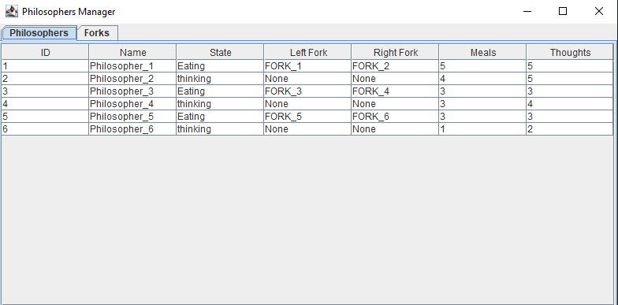

# ProvaPPD

# Simulação do Jantar dos Filósofos Jantando

Este projeto implementa uma simulação do **Problema do Jantar Filósofos** utilizando Java. A simulação inclui um protocolo de comunicação baseado em comandos, permitindo que os usuários interajam com o servidor, gerenciem filósofos e visualizem seu status e estatísticas.

## Funcionalidades
- Protocolo de comunicação baseado em comandos.  
- Criação e gerenciamento dinâmico de filósofos.  
- Obtenção de estatísticas em tempo real sobre os filósofos e o status do sistema.  
- Interface gráfica (GUI) para visualização da mesa de jantar.  

## Diagrama 


## Exemplo



## Execução

Conectar ao servidor utilzando o comando ```telnet localhost 12345```.